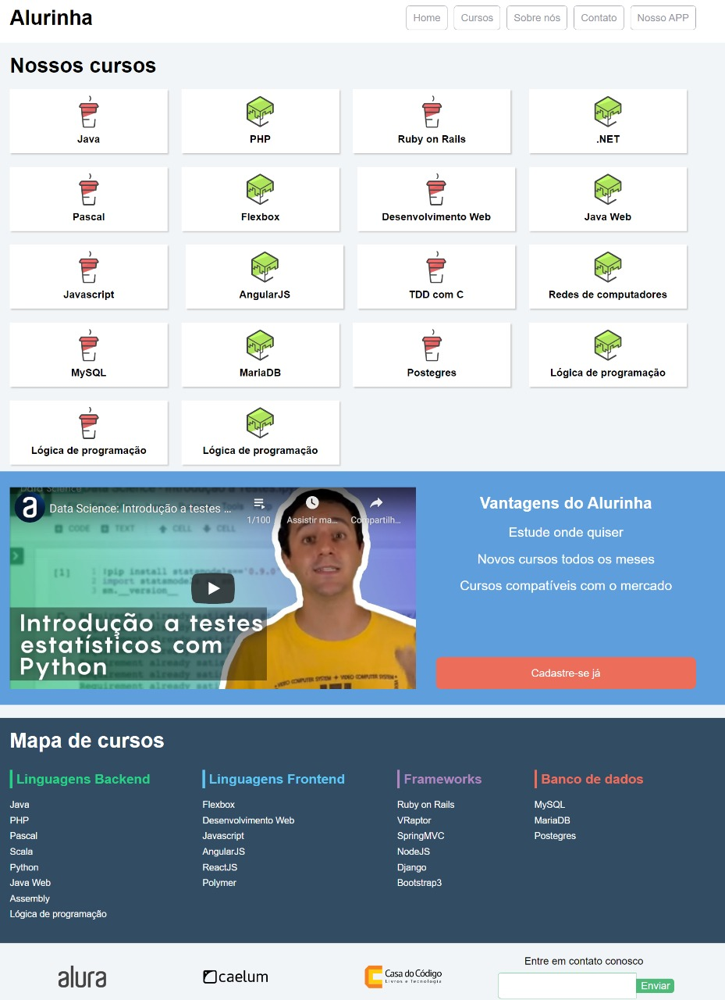

# Alurinha
Projeto feito na trilha Front-end do curso da Alura utilizando Flex-box

  

 
<h1 align="center"> 
    
  

  
  🚀 Tecnologias utilizadas

✔️ HTML5 
  

✔️ CSS3 
  

  
  Feito por Luciano Lima Jr.
  
</h1>

